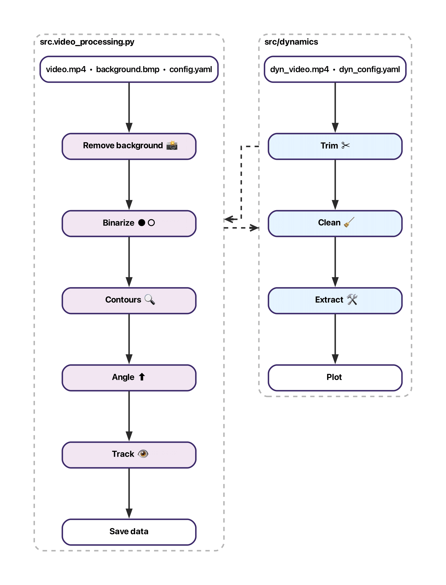

# Pogotrack

<p align="center">
  
</p>


Pogotrack is a lightweight video-processing and analysis toolkit for reproducible tracking of Pogobot swarm experiments, estimating per-robot pose $(x, y, \theta)$ and persistent IDs from video.  
It is designed to remain robust across lighting conditions and lenses by relying on simple fiducials and standard computer-vision primitives.

Pogotrack is primarily intended for experiments with **[Pogobots](https://pogobot.github.io/)**, an open-source, open-hardware low-cost robot platform for swarm robotics research and programmable active matter. See the Pogobot [paper]( https://arxiv.org/abs/2504.08686) (DOI: 10.48550/arXiv.2504.08686).

---

## Features

Soon a cool graphics here :wink:

### Video processing (pose + IDs)
Given a video experiment and a background image, the pipeline:
- Removes background and segments foreground (thresholding).
- Detects contours for each Pogobot.
- Estimates orientation using a center-of-luminance heuristic.
- Assigns persistent IDs using tracking utilities [TrackPy](https://soft-matter.github.io/trackpy/v0.7/).
- Exports a time series of $(x, y, \theta, \mathrm{ID})$ for each agent.

### Dynamics workflow (motion characterization)
For videos containing systematic PWM sweeps / repeated runs, the dynamics workflow:
- Trims recordings into run segments.
- Filters trajectories (e.g., wall interactions, invalid data).
- Computes observables such as linear speed $v$, angular speed $\omega\$, curvature radius $R$ (with MSD-based estimators when applicable).
- Produces diagnostic plots vs PWM.

> Pogotrack is under active development; the current release focuses on:
> (i) `src/video_processing.py` and (ii) the `src/dynamics/` workflow.

<p align="center">
  
</p>

---
## Repository layout
```text
pogotrack/
├── main.py                      # CLI entry point for the full tracking pipeline
├── src/
│   ├── video_processing.py      # Core tracking: background removal → contours → (x,y,theta) → ID assignment
│   ├── utils.py                 # CV + tracking utilities used by video_processing
│   ├── plot_helpers.py          # Debug plots (contours, trajectories, GIFs)
│   └── dynamics/                # Automated motion characterization workflow (PWM sweeps, observables, plots)
├── config/
│   ├── default.yaml             # Default tracking configuration
│   ├── default_ISIR.yaml        # Arena/experiment-specific configuration (example)
│   └── dynamics.yaml            # Dynamics workflow configuration
├── stl/                         # Exoskeleton STL files for trackable Pogobots
├── data/                        # Example inputs (videos/backgrounds)
├── results/                     # Example outputs (CSV, GIFs, plots)
├── requirements.txt             # Python dependencies
├── README.md
└── build/ / source/ / venv_sphinx/  # Docs build + Sphinx source + docs venv (optional)
```

---
## Installation
```bash
# From the repo root
python -m venv .venv
source .venv/bin/activate

python -m pip install -U pip
pip install -r requirements.txt
```
---

## Usage

Run the main script with:

```bash
python3 -m main \
  --video data/example.mp4 \
  --background data/bkg.bmp \
  --output results/tracking.csv \
  --config config/default.yaml \
```
---

## Configuration

Pogotrack is configured via YAML files in `config/` (e.g. `config/default.yaml`).

### Video processing parameters
- `N_POGO`: Expected number of robots in the arena.
- `THRESHOLD`: Binarization threshold for foreground segmentation.
- `AREAS`: `[MIN, MAX]` contour area range (px²) to accept detected blobs.
- `PERIMETERS`: `[MIN, MAX]` contour perimeter range (px) to accept detected blobs.
- `CENTER`: Arena center in pixels `[X, Y]` (used to build arena mask).
- `RADIUS`: Arena radius in pixels (circular mask).
- `RECT_MASK`: If `true`, use a rectangular mask instead of a circular one.
- `WIDTH`, `HEIGHT`: Rectangular mask size in pixels (used when `RECT_MASK: true`).
- `SEARCH_RANGE`: Track linking search range in pixels (TrackPy).
- `MEMORY`: Max number of frames a robot can disappear and still keep the same ID.

### Units conversion / timing
- `FPS`: Frames-per-second used to convert frame index → time (seconds).
- `POGOBOT_DIAMETER_CM`: Pogobot physical diameter (cm).
- `PIXEL_DIAMETER`: Pogobot apparent diameter (px) used for calibration (cm ↔ px).

### Plotting parameters (`PLOTTING:` section)
- `CENTROIDS_SIZE`: Marker size for robot centroid visualization.
- `ARROW_LENGTH_FRAME`: Arrow length for per-robot direction on frames.
- `TIP_LENGTH`: Arrow tip length fraction for OpenCV arrows.
- `ARROW_LENGTH_VIS`: Arrow length for arena visualization.
- `ARENA_RADIUS`: Radius of circles drawn at each robot position in arena viz.
- `ARENA_XLIM`, `ARENA_YLIM`: Axis limits for arena plots.
- `HEAD_WIDTH`, `HEAD_LENGTH`: Arrow head parameters for Matplotlib arrows.
- `TRAJECTORY_DPI`: DPI for saved trajectory figures / GIFs.

---

## Debugging tools

### Per-frame debug visualization
Use frame-level visualizations to validate each processing step:
- Background subtraction
- Thresholding
- Contour detection
- Heading (`theta`) estimation

### Trajectory plots
Plot `(x, y)` trajectories per `particle`, optionally on the arena background, to spot:
- Scaling mistakes (cm ↔ px)
- Coordinate flips
- Drift or ID swaps

### GIF reconstruction
Create a GIF overlay using inferred `(x, y, theta)` on top of a background image.  

---

## Maintainers

- [Keivan Amini](https://keivan-amini.github.io/), PhD student @ Sorbonne Université / ESPCI
- [Jérémy Fersula](https://www.isir.upmc.fr/personnel/fersula/), PostDoc @ Sorbonne Université